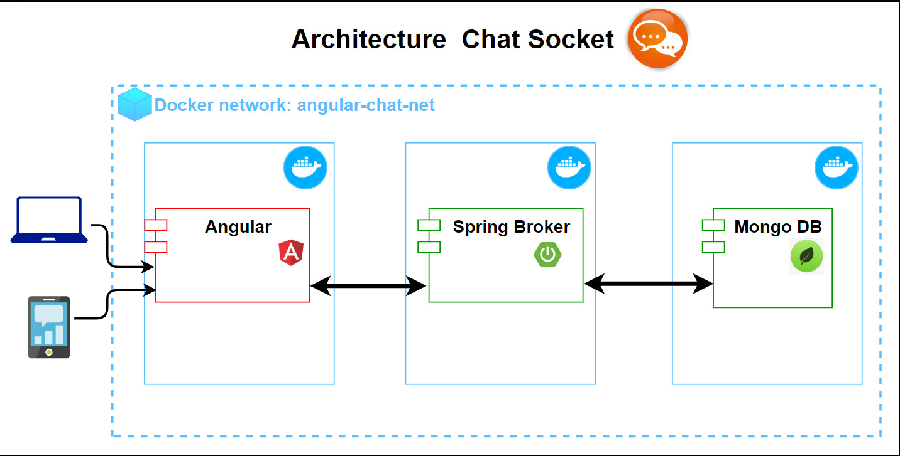

# CHAT SOCKET CHALLENGE 
 
Some Startup company chats called Called-now need to improve their way of scaling their infrastructure, so they choose Kubernetes to fulfill this goal. They used docker-compose in their first approach; however, now they want to cover new boundaries to get better results in their business. 

## The Challenge 

This is the architecture of the current system; the main idea is to migrate it to Kubernetes.

 
They need you to implement the following features. 

1. All components need to be implemented in pods.  

2. Implement Secrets for credentials of database (user name and password)

3. Implement Config Maps for the hostname of the database,   profile, and port in the microservice called  "backend."

4. Implement a Probe to test the healt Status of the microservice(Mandatory) and database(Optional)

5. Implement a ingress Controller using Ngnix

6. Create a Pull request in  this  repository  to evaluate your  advances, and store your manifesto files in the deploy folder. 

 

## Prerequisites 

* ***Docker***: you need install it to deploy the proyect. 
* ***Minikube***: you need install it to work with kubernetes. 
* ***Command line***: you need it to execute the performance commands to enable the project

## Commands 
 
These commands allow deploy the main components of the project: 

1. **Enable all components** 
+ docker-compose up -d  
2. **Disable all components** 
+ docker-compose down  
5. **Show Web Page**
+ http://localhost:4200 
 

